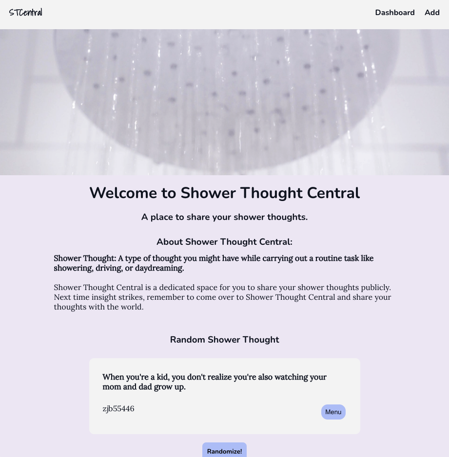
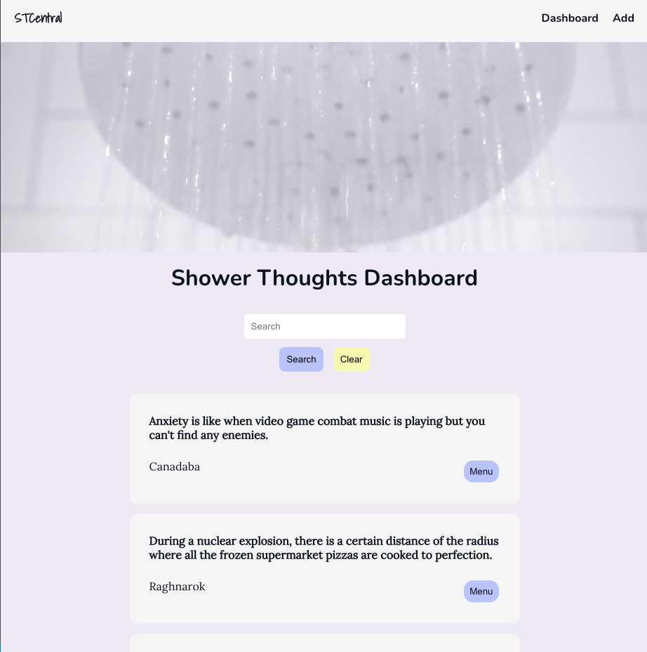
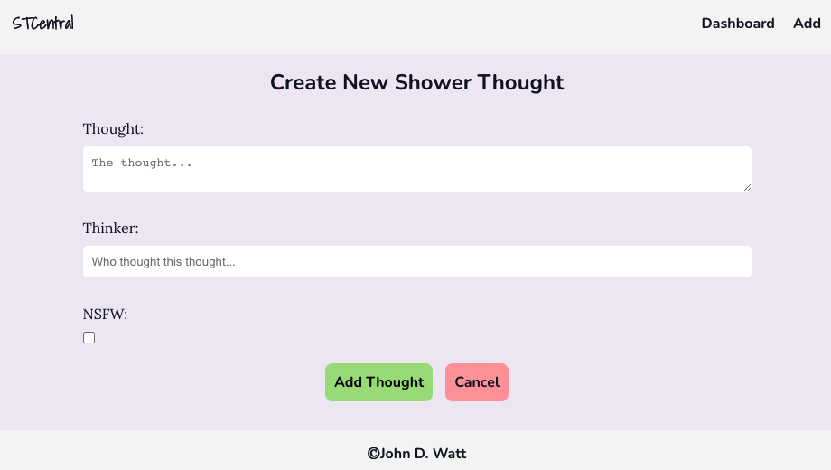
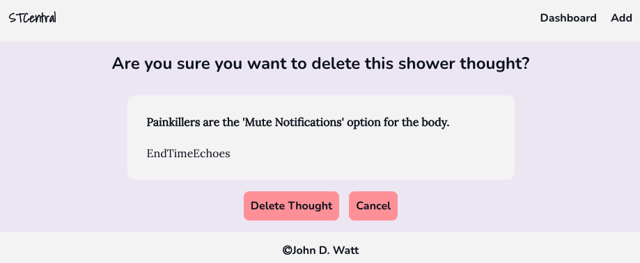

# Shower Thought Central
Full Stack MERN application for sharing your shower thoughts

=== OVERVIEW ===

=== What is a Shower Thought? === 

Shower Thought: A type of thought you might have while carrying out a routine task like showering, driving, or daydreaming.

=== Overall Concept === 

‘Shower Thought Central’ is a full-stack MERN (Mongoose/Express/React/Node) application where users can share their shower thoughts with the world. The application features an independently hosted express API, a randomization algorithm, full CRUD functionality, client-side RESTful routing, and a mobile-first responsive design.

=== Link to live site ===

You can access ‘Shower Thought Central’ and begin sharing your shower thoughts here:

https://johndwatt.github.io/shower-thoughts-frontend/

This is the backend API code for Shower Thought Central. You can see the frontend repository for this application [here](https://github.com/johndwatt/shower-thoughts-frontend).

=== Developer Installation ===

To install this application on your local machine, fork and clone down this repo and the [front-end repo](https://github.com/johndwatt/shower-thoughts-frontend). 

You will need node.js to run this application on your local machine. Run "npm install" to download all dependencies for the application.

Once all dependencies are downloaded, you can spin up the backend server with "node server.js". Spin up the front-end with "yarn start".

=== Main Technologies ===

- Javascript
- React
- Node
- Express
- Mongoose
- MongoDB 
- CSS

=== Pictures of Site ===

